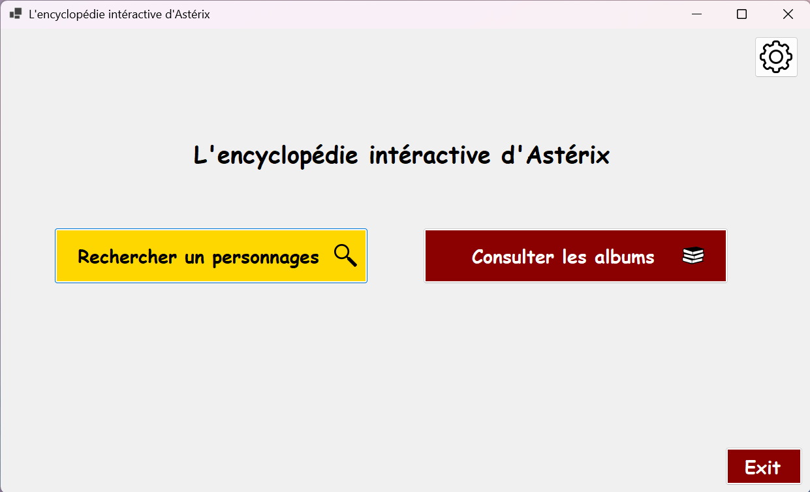
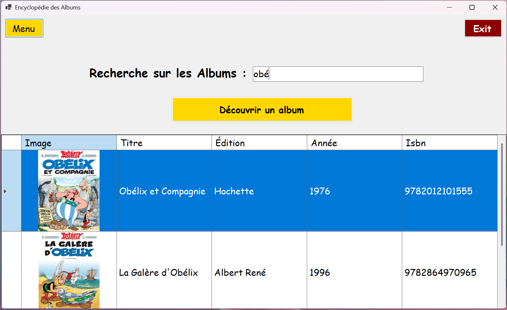
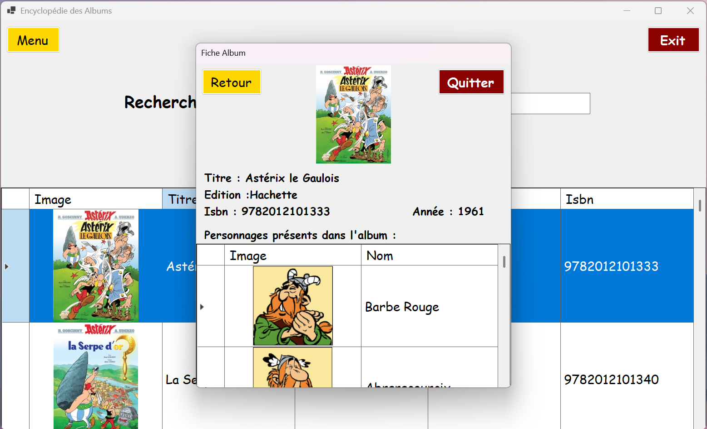
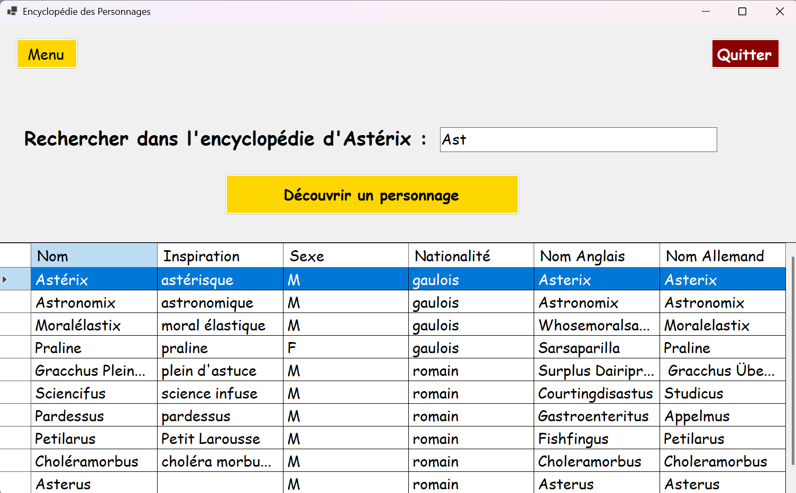
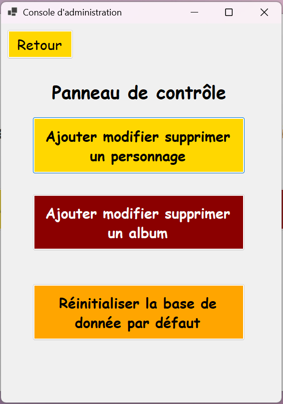
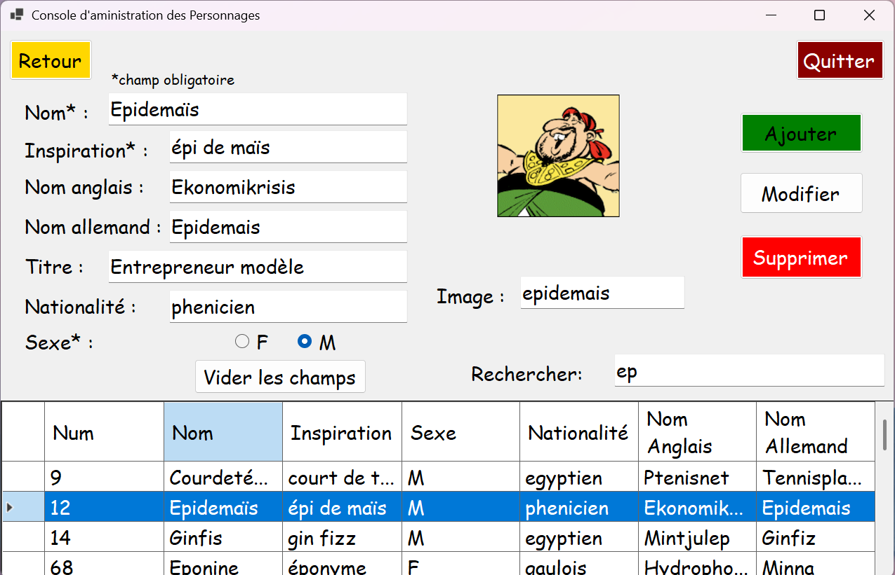
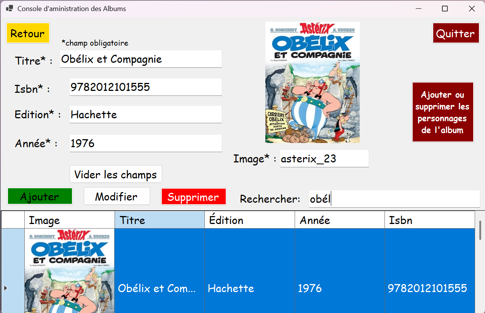
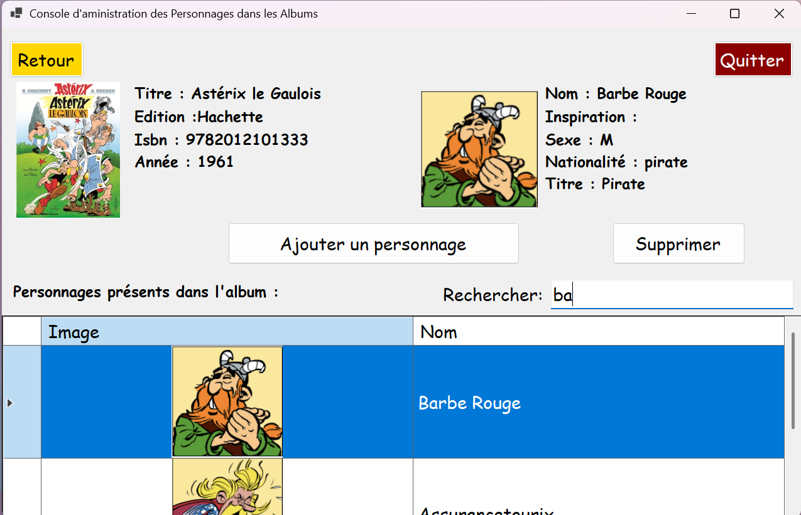

## Version
v1.0.0

# 🎨 L'encyclopédie d'Astérix
L'encyclopédie d'Astérix est une application Windows Forms développée en C# permettant de gérer et d'explorer des albums de bandes dessinées ainsi que leurs personnages associés. Elle offre une interface conviviale pour visualiser les détails des albums et des personnages, avec des images intégrées et des fonctionnalités de recherche.

## 🧰 Fonctionnalités
Affichage des albums : Liste des albums disponibles avec leurs informations détaillées.

Gestion des personnages : Visualisation des personnages associés à chaque album, avec leurs images et descriptions.

Recherche avancée : Possibilité de rechercher des personnages en fonction de divers critères (nom, inspiration, sexe, etc.).

Interface utilisateur intuitive : Utilisation de DataGridView pour afficher les données de manière structurée et interactive.

## 🛠️ Technologies utilisées
Langage : C#

Framework : .NET Framework (Windows Forms)

Base de données : SQLite

Bibliothèques externes :

System.Data.SQLite pour la gestion de la base de données SQLite.

lib_FunEnBulles : Bibliothèque personnalisée pour l'accès aux données.

## 📦 Installation
Cloner le dépôt :

bash
git clone https://github.com/benjaminlrl/App_FunEnBulles.git
Ouvrir le projet :

Ouvre le fichier App_FunEnBulles.sln avec Visual Studio.

Restaurer les packages NuGet :

Dans Visual Studio, va dans Outils > Gestionnaire de packages NuGet > Console du Gestionnaire de packages.

Exécute la commande suivante :

powershell
Update-Package -reinstall
Configurer la base de données :

Assure-toi que le fichier de base de données SQLite est présent et que la chaîne de connexion est correctement configurée dans le code.

## 🚀 Utilisation
Lancer l'application :

Appuie sur F5 dans Visual Studio pour exécuter l'application.

Naviguer dans l'application :

Utilise l'interface pour parcourir les albums et les personnages.

Utilise la fonction de recherche pour filtrer les personnages selon différents critères.

## 📸 Captures d'écran
### Acceuil

### Recherche d'album

### Fiche détaillé de l'album sélectionné

### Recherche de personnages

###  Fiche détaillé du personnage sélectionné

### Panneau de controle

### Panneau de controle des personnages

### Panneau de controle des albums

### Panneau de controle des personnages présent dans les albums

## 📥 Télécharger l'application
La première version de l'application Astérix est maintenant disponible en téléchargement :
### Version portable windows :
- [📥 Télécharger la version 1.0.0 pour win-x64](https://github.com/benjaminlrl/App_FunEnBulles/releases/download/v1.0.0/FunEnBulles_1.0.0_win-x64.zip)
### Version open source
- [📥 Télécharger la version 1.0.0 open source](https://github.com/benjaminlrl/App_FunEnBulles/releases/download/v1.0.0/FunEnBulles_1.0.0.zip)

## 🤝 Contribuer
Les contributions sont les bienvenues ! N'hésite pas à forker le projet et à proposer des améliorations via des pull requests.
